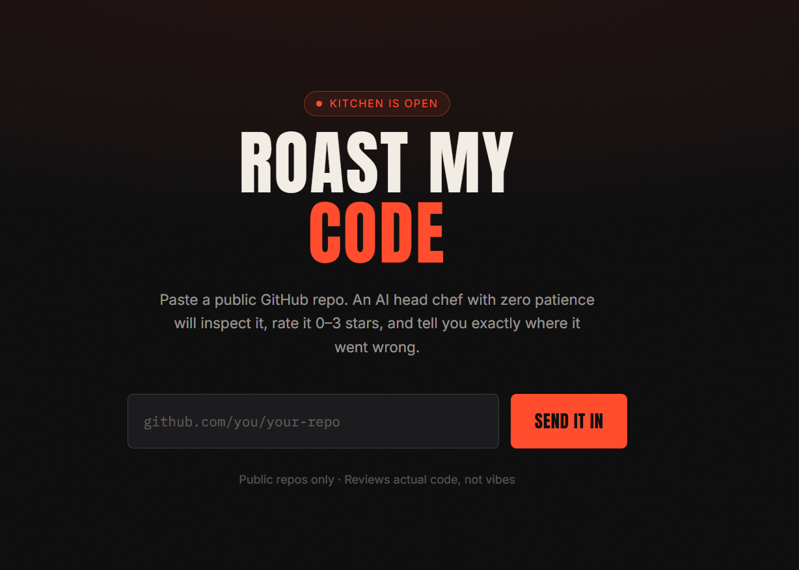
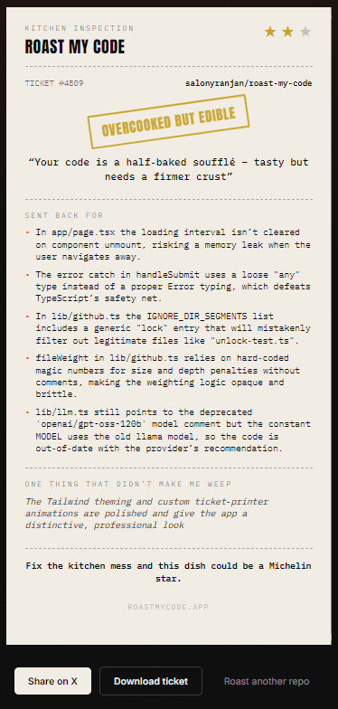

<div align="center">


<br/>

**Paste a GitHub repo. Get inspected, insulted, and — rarely — complimented.**
<br/>Every repo becomes a printed kitchen ticket: a 0–3 star rating, a rubber-stamped verdict, and a list of exactly what got it sent back — grounded in the actual code, not generic AI slop.

<br/>

<!--
  Replace this with a real demo GIF or screenshot before you publish.
  Record a 10-15s clip of pasting a repo URL → watching the ticket print → downloading it.
  This is the single biggest driver of stars — put it right at the top.
-->


<br/><br/>

[](https://roast-my-code-delta.vercel.app/)
[](https://vercel.com/new/clone?repository-url=https://github.com/salonyranjan/roast-my-code&env=GROQ_API_KEY&envDescription=Get%20a%20free%20key%20from%20console.groq.com/keys)
[](./LICENSE)
[](https://github.com/salonyranjan/roast-my-code/stargazers)


</div>

---

### 🍽️ Sample ticket

*(what comes back when you paste a repo — this is the shareable artifact itself, not a chat transcript)*

<div align="center">

</div>

---

## Why this exists

Every "paste your code, get AI feedback" tool reads like a linter with a chatbot bolted on. This one is built to be screenshotted: a real persona committed to fully, a shareable result instead of a wall of chat, and complaints that cite your actual files instead of generic advice.

## How it works

1. You paste a public GitHub repo URL.
2. The server pulls the README, manifest files, and a weighted sample of source files (biggest, shallowest, most "entrypoint-shaped" first) — capped so it stays fast and cheap.
3. That code goes to Claude with a strict system prompt: stay in character, but every complaint has to be a real, specific, technically accurate observation. No invented problems.
4. The model returns a structured verdict — star rating, rubber-stamp headline, complaints, one grudging compliment, closing line.
5. It renders as a torn-edge kitchen ticket you can download as a PNG or share straight to X.

## Tech stack

**Next.js 14** (App Router) · **TypeScript** · **Tailwind CSS** · [**Groq**](https://groq.com) (Llama 3.3 70B) · **GitHub REST API** · `html-to-image` for the shareable PNG export.

---

## Run it locally

```bash
git clone https://github.com/salonyranjan/roast-my-code.git
cd roast-my-code
npm install
cp .env.example .env.local   # add your GROQ_API_KEY
npm run dev
```

Open [localhost:3000](http://localhost:3000).

### Environment variables

| Variable | Required | Notes |
|---|:---:|---|
| `GROQ_API_KEY` | ✅ | Free at [console.groq.com/keys](https://console.groq.com/keys) |
| `GITHUB_TOKEN` | optional | Raises GitHub's unauthenticated rate limit from 60/hr to 5000/hr. No permissions needed beyond public read. |

## Deploy your own

[](https://vercel.com/new/clone?repository-url=https://github.com/salonyranjan/roast-my-code&env=GROQ_API_KEY&envDescription=Get%20a%20free%20key%20from%20console.groq.com/keys)

One click, add your `GROQ_API_KEY`, done.

---

## Design notes

The visual language is a kitchen inspection ticket, not a chat window — torn paper edges, a dashed order-slip layout, a rubber stamp for the verdict, printed in a monospace "ticket printer" font. The whole point is that the *output* is the shareable artifact, so it had to look like something worth screenshotting on its own, without any UI chrome around it.

## Roadmap / ideas

- [ ] Persona picker (brutal senior dev, disappointed professor, etc.)
- [ ] Compare two repos head-to-head
- [ ] Public leaderboard of the worst-rated public repos (opt-in)
- [ ] Roast a single file via drag-and-drop, no repo required

Contributions and persona ideas welcome — open an issue or a PR.

## License

MIT — see [LICENSE](./LICENSE).

---

<div align="center">

### 🔥 If your code got roasted and you liked it — that's the whole point. Star it.

<a href="https://github.com/salonyranjan/roast-my-code/stargazers"></a>
&nbsp;
<a href="https://github.com/salonyranjan/roast-my-code/fork"></a>
&nbsp;
<a href="https://roast-my-code-delta.vercel.app/"></a>

<br/><br/>


Built by [**Salony Ranjan**](https://github.com/salonyranjan). If your code got roasted and you're mad about it, that's kind of the point — [share it](https://twitter.com/intent/tweet) anyway.

</div>
